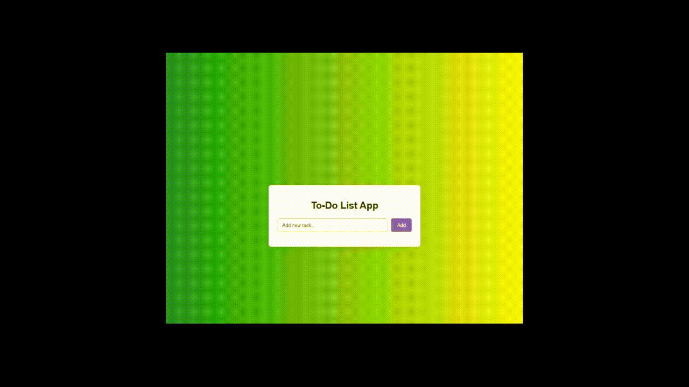

# ✅ Simple To-Do List App

This is a clean and simple to-do list app that lets you add, manage, and organize your daily tasks. It's ideal for beginners who want to understand the basics of web development.

---

## 🚀 Features

- **Add Tasks**: Easily add new tasks to the list, either by clicking the button or pressing the Enter key.
- **Mark as Complete**: Click on a task to cross it off, indicating that you have completed it.
- **Remove Tasks**: Remove tasks individually with a delete button.
- **Local Storage**: Your tasks are saved in the browser, so they won't be lost when the page is reloaded.
- **Intuitive Interface**: A minimalist and user-friendly design that is easy to use.

---

## 📸 Demo

Here's a quick look at the app in action:



---

## 🛠️ Tecnologies Used

- **HTML5**: Page structure and markup.
- **CSS3**: Styling and responsive design.
- **JavaScript** (ES6+): Logic for adding, removing, and marking tasks.

---

## 📦 How to run

1. Clone the repository:

   ```bash
   git clone https://github.com/tiagogalvao7/todolist-app.git
   ```

2. Open the `index.html` file in any modern browser. No web server or dependency installation is required.
